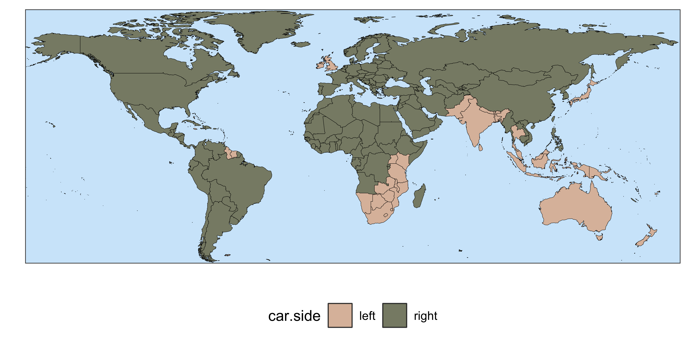

<!-- README.md is generated from README.Rmd. Please edit that file -->

# countries

<!-- badges: start -->
<!-- badges: end -->

`countries` is an R package designed to quickly wrangle, merge and
explore country data. This package contains functions to easily identify
and convert country names, pull country info and datasets, merge country
data from different sources, and easily make world maps.

## Installing and loading the package

The package can be installed from CRAN.

``` r
# Install package from CRAN
install.packages("countries")

# load package
library(countries)
```

Alternatively, the development version can be downloaded directly from
the Github repository. This can be done with the `devtools` package.

``` r
# Install and load devtools
install.packages("devtools")
library(devtools)

# Install countries
devtools::install_github("fbellelli/countries", build_vignettes = TRUE)

# load package
library(countries)
```

## Dealing with country names

The package contains several functions to work with country names. For
instance, the function `country_name()` can be used to convert country
names to different naming conventions or to translate them to different
languages. `country_name()` can identify countries even when they are
provided in mixed formats or in different languages. It is robust to
small misspellings and recognises many alternative country names and old
nomenclatures. Learn more about how to deal with country names in [this
article](https://fbellelli.github.io/countries/articles/dealing_with_names.html).

``` r
example <- c("US","C@ète d^Ivoire", "Morocco","FYROM", "Arabie Saoudite")

# Getting 3-letters ISO code
country_name(x= example, to="ISO3")
#> [1] "USA" "CIV" "MAR" "MKD" "SAU"

# Translating to spanish
country_name(x= example, to="name_es")
#> [1] "Estados Unidos"      "Costa de Marfil"     "Marruecos"          
#> [4] "Macedonia del Norte" "Arabia Saudita"

# Getting multiple nomenclatures
country_name(x= example, to=c("ISO3","ISO2","UN_en"))
#>   ISO3 ISO2                    UN_en
#> 1  USA   US United States of America
#> 2  CIV   CI            Côte d’Ivoire
#> 3  MAR   MA                  Morocco
#> 4  MKD   MK          North Macedonia
#> 5  SAU   SA             Saudi Arabia
```

The function `is_country()` can be used to test for country names or
subsets of countries:

``` r
#Detect strings that are country names
is_country(x = c("ITA","Estados Unidos","bungalow","dog",542))
#> [1]  TRUE  TRUE FALSE FALSE FALSE

#Checking for a specific subset of countries
is_country(x = c("Ceylon","LKA","Indonesia","Inde"), check_for = c("India","Sri Lanka"))
#> [1]  TRUE  TRUE FALSE  TRUE
```

The functions `list_countries()` and `random_countries()` allow to get a
list of country names. The former will return a list of ALL countries,
while the second provides `n` randomly picked countries.

``` r
# Get 5 random country names in different languages/nomenclatures
random_countries(5)
#> [1] "Sweden"  "Macao"   "Iceland" "Egypt"   "Ecuador"
random_countries(5, nomenclature = "ISO3")
#> [1] "CZE" "GBR" "URY" "MAC" "PAK"
random_countries(5, nomenclature = "name_ar")
#> [1] "قطر"             "الصحراء الغربية" "نيوزيلندا"       "سريلانكا"       
#> [5] "جمهورية الكونغو"
```

## Getting information about countries

`country_info()` allows to download a variety of information about
countries from [REST Countries API](https://restcountries.com/), such
as: currencies used, capital city, language spoken, flag, neighbouring
countries, and much more. You can find [more information about this
function](https://fbellelli.github.io/countries/reference/country_info.html)
in the documentation.

``` r
# What are the official languages of Switzerland?
country_info("Switzerland", "languages")
#> Warning in country_info("Switzerland", "languages"): Unable to connect to API.
#> There might be a problem with Countries REST API.
#> NULL

# Get information on the capital name and currencies for multiple countries
country_info(c("Canada", "Mozambique", "India"), c("capital", "currencies"))
#>    countries   capital    currencies.name currencies.symbol
#> 1     Canada    Ottawa    Canadian dollar                 $
#> 2 Mozambique    Maputo Mozambican metical                MT
#> 3      India New Delhi       Indian rupee                 ₹
```

## Easy country maps

With `quick_map()`, it takes only one line of code to produce
[chloropleth maps](https://en.wikipedia.org/wiki/Choropleth_map). It
automatically recognises country names in multiple languages and
nomenclatures. This allows to produce publication-grade maps in seconds.
Moreover, the output is a ggplot object, so the visual look can be
customised in infinite ways. You can find [more examples in this
article](https://fbellelli.github.io/countries/articles/quick_map.html).

``` r
# downloading some sample data to plot
example_data <- country_info(fields = c("car"))

# make a map
quick_map(example_data, plot_col = "car.side")
```



## Merging country data

The function `auto_merge()` simplifies the merging of country data
tables by: **1)** allowing merging of 2+ tables at the same time, **2)**
Supporting automatic detection of columns to merge, **3)** automatically
handling different country naming conventions and date formats, **4)**
automatic pivoting of country names or years in tables’ headers. Learn
more about country names functions in [this
article](https://fbellelli.github.io/countries/articles/auto_merge.html).

``` r
# Let's create 4 tables with different formats and country names
tab1 <- data.frame(country = c("Italy", "Pakistan", "Brazil"), world_cups = c(4, 0, 5))
tab2 <- data.frame(exporter = c("DEU", "DEU", "ITA", "ITA"), HS_chapter = c(9, 85, 9, 85), volume = c(800, 5000, 1000, 2000))
tab3 <- data.frame(HS = c(9, 85), Description = c("Coffee, tea and mate", "Electrical machinery"))
tab4 <- data.frame(year = c(2010, 2011), Allemagne = runif(2), Brésil = runif(2), Pakistan = runif(2))

# These tables can easily be merged with one line of code:
auto_merge(tab1, tab2, tab3, tab4)
#> Identifying columns to merge
#> Table 4 - countries detected in column names, pivoting columns: Allemagne, Brésil, Pakistan
#> Converting country names
#> Checking time columns
#> The following columns are being merged:
#> 
#> =======  =======================  ====  ==========
#> \        country                  time  HS_chapter
#> =======  =======================  ====  ==========
#> Table 1  country                                  
#> Table 2  exporter                       HS_chapter
#> Table 3                                 HS        
#> Table 4  Table4_pivoted_colnames  year            
#> =======  =======================  ====  ==========
#>                                               Performing merge: 1/3                                               Performing merge: 3/3                                               Performing merge: 2/3                                               Merge complete
#> (Set merging_info to TRUE to save merging details)
#>    country world_cups HS_chapter volume time Table4_pivoted_values
#> 1      ITA          4          9   1000   NA                    NA
#> 2      ITA          4         85   2000   NA                    NA
#> 3      PAK          0         NA     NA 2010             0.9852906
#> 4      PAK          0         NA     NA 2011             0.6920557
#> 5      BRA          5         NA     NA 2010             0.9409735
#> 6      BRA          5         NA     NA 2011             0.8452781
#> 7      DEU         NA          9    800 2010             0.5690862
#> 8      DEU         NA          9    800 2011             0.8562227
#> 9      DEU         NA         85   5000 2010             0.5690862
#> 10     DEU         NA         85   5000 2011             0.8562227
#>             Description
#> 1  Coffee, tea and mate
#> 2  Electrical machinery
#> 3                  <NA>
#> 4                  <NA>
#> 5                  <NA>
#> 6                  <NA>
#> 7  Coffee, tea and mate
#> 8  Coffee, tea and mate
#> 9  Electrical machinery
#> 10 Electrical machinery
```
